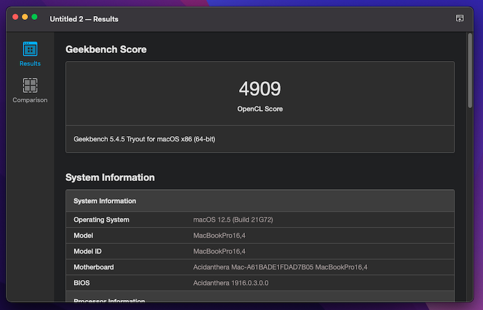

### 以下跑分仅供参考  
---  
  
---  
> VideoProc识别图  
---  
  
---  
> 硬盘跑分  
---  
  
---  
> Blackmagic Disk Speed Test 硬盘跑分  
---  
  
---  
> Blackmagic RAW Speed Test CPU/GPU解码测试  
---  
  
---  
> Geekbench5 CPU 跑分  
---  
  
---  
> Geekbench5 GPU OpenCL跑分  
---  
  
---  
> Geekbench5 GPU Metal跑分  
---  
  
---  
> 电池识别图  
---  
  
---  
> 蓝牙识别图  
---  
  
---  
> WIFI识别图  
---  
  
---  
> 以太网识别图  
---  
  
---  
> 传感器识别图  
---  
  
---  
> NVME识别图  
---  
  
---  
> CPU频率识别图  
---  
  
---  
> 热键使用以及系统信息  
--- 
> > 跑分仅供参考  
> > 该页内容仅作功能可用展示  
> > 后续仅添加新功能 不会更新已放出图片  
---
```
By Nanami/Forever (Hikarisame Technology Studio)
2022/08/18 0:21:35 (UTC+8)
```